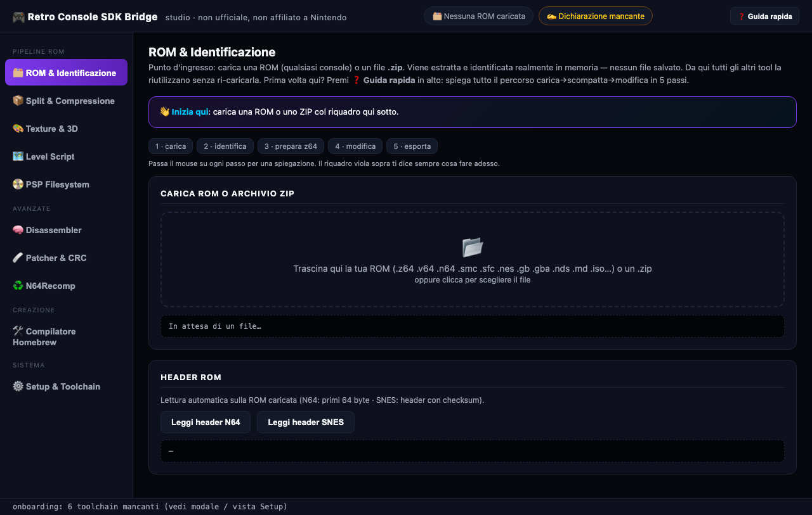
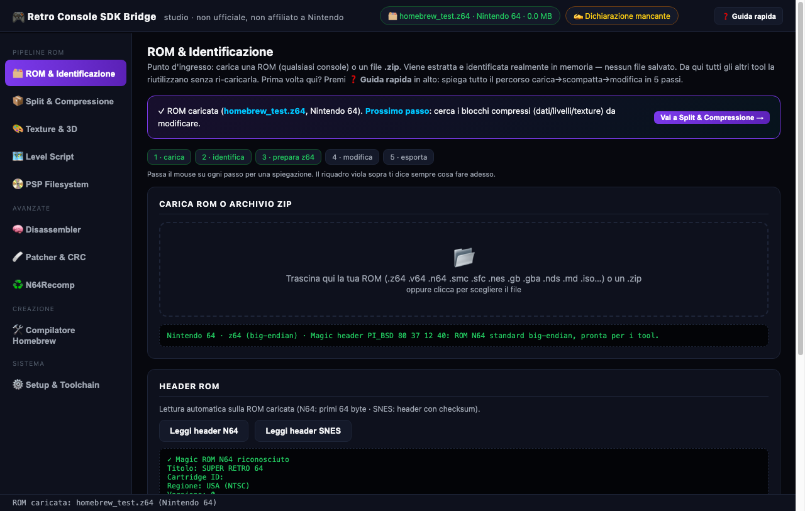
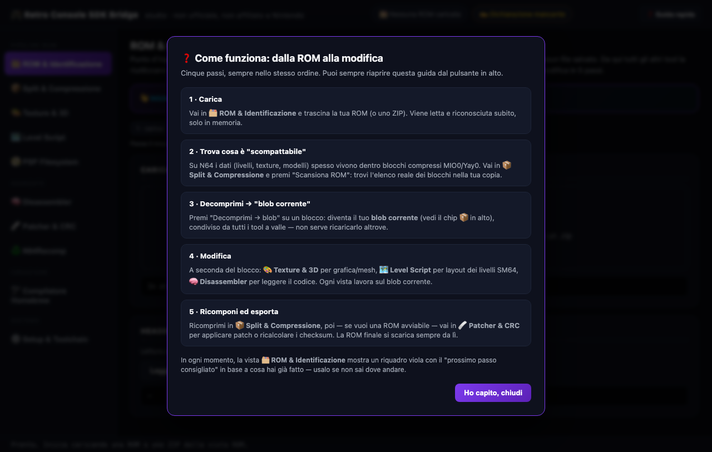
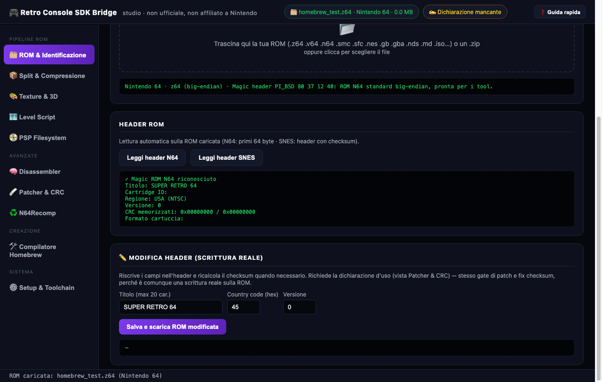
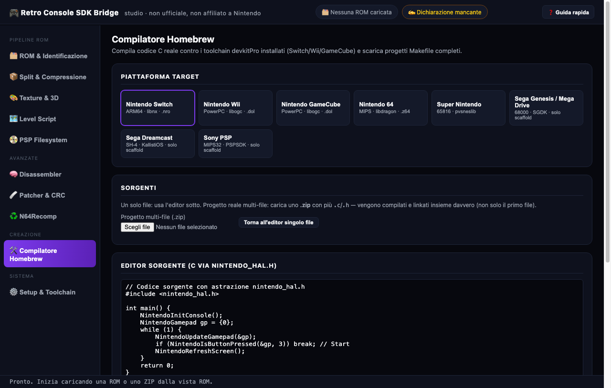
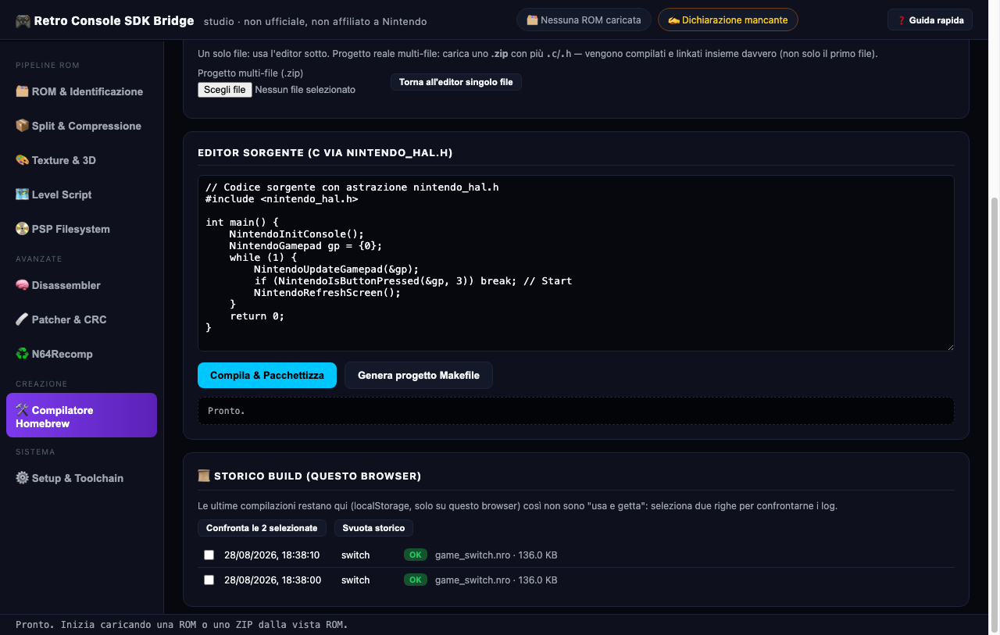

# 🎮 Retro Console SDK Bridge

[English](#english) | [Italiano](#italiano)

Independent project, unofficial, not affiliated with or endorsed by Nintendo. /
Progetto indipendente, non ufficiale, non affiliato né approvato da Nintendo.

---

## English

Local web studio for compiling real C code against the `include/nintendo_hal.h`
hardware abstraction, which wraps **real, open-source** homebrew SDKs for
Nintendo consoles: [libnx](https://github.com/switchbrew/libnx) (Switch),
[libogc](https://github.com/devkitPro/libogc) (Wii/GameCube),
[libdragon](https://github.com/DragonMinded/libdragon) (N64) and
[pvsneslib](https://github.com/alekmaul/pvsneslib) (SNES), all installable for
free via [devkitPro](https://github.com/devkitPro/pacman). Also handles real
ROM tooling for N64/SNES/Genesis/PSP: identification, MIO0/Yay0
decompression, texture/F3D mesh decoding, MIPS disassembly, IPS/BPS
patching, checksum fixing, and — as of this update — real header write-back
(not just inspection).

### Screenshots

Captured with real headless Chrome against the actual running app (driven
via the DevTools Protocol to set up real state — a loaded synthetic ROM, a
real compiled build) — not mockups.

| Guided entry point | Contextual next-step banner |
|---|---|
|  |  |

A persistent banner in the ROM view always tells a first-time user what to
do next, with a button that jumps straight to the right section — added
specifically so the app can guide someone through load → unpack → modify
without getting lost among the 10 sidebar sections.

| Quick-guide modal | ROM header editor (real write-back) |
|---|---|
|  |  |

The header editor writes real bytes back into the ROM (title/country/version
for N64; title/version/destination for SNES, with automatic checksum
recalculation) — not just an inspector, gated behind the same usage
declaration as the patcher.

| Multi-file project source | Build history (this browser) |
|---|---|
|  |  |

A ZIP with multiple `.c`/`.h` files is unpacked and compiled+linked together
for real (not just the first file); every build's log/outcome is kept in
this browser's `localStorage` for later comparison.

### What's real vs simulated, stated honestly

Everything shown above is the actual running app, not staged screenshots of
different mockups: the ROM is a real synthetic N64 header (real magic bytes,
real parsed fields), the compiled Switch binary is a genuine `.nro` produced
by the real devkitA64 toolchain via two linked object files, and the build
history entries are real localStorage writes from that real compile. See the
Italian section below for the full, continuously-updated development log —
every fix and feature is documented there with what was verified and how.

---

## Italiano

Studio web locale per compilare codice C contro l'astrazione hardware
`include/nintendo_hal.h`, che avvolge gli SDK homebrew **reali e open-source**
per console Nintendo: [libnx](https://github.com/switchbrew/libnx) (Switch),
[libogc](https://github.com/devkitPro/libogc) (Wii/GameCube),
[libdragon](https://github.com/DragonMinded/libdragon) (N64) e
[pvsneslib](https://github.com/alekmaul/pvsneslib) (SNES), tutti installabili
gratuitamente via [devkitPro](https://github.com/devkitPro/pacman). Gestisce
anche il toolkit ROM reale per N64/SNES/Genesis/PSP: identificazione,
decompressione MIO0/Yay0, decodifica texture/mesh F3D, disassembly MIPS,
patching IPS/BPS, fix checksum e — da questo aggiornamento — scrittura reale
dell'header (non solo lettura).

### Screenshot

Catturati con Chrome headless reale contro l'app effettivamente in
esecuzione (pilotato via DevTools Protocol per impostare stato reale — una
ROM sintetica caricata, una build compilata per davvero) — non mockup.

| Guida contestuale | Editor header ROM (scrittura reale) |
|---|---|
|  |  |

Un riquadro sempre visibile nella vista ROM dice all'utente cosa fare dopo,
con un pulsante che porta dritto alla sezione giusta — pensato apposta per
non far perdere l'utente tra le 10 sezioni della barra laterale durante il
percorso carica → scompatta → modifica.

| Storico build (questo browser) |
|---|
|  |

Dettagli e motivazioni complete nella cronologia di sviluppo qui sotto.

### Nota onesta sullo stato v1.1 → v1.2

La v1.0 fingeva sempre un compile "riuscito": se il toolchain reale non era
installato, generava un file di 16KB quasi vuoto con solo un header magico,
accompagnato da log fabbricati che non corrispondevano a nessuna vera
compilazione. La v1.1 ha corretto questo: rilevamento reale del toolchain,
compilazione reale col compilatore reale se presente, mai un fallback
fittizio. A quel punto però il link reale per Switch falliva sempre con un
errore del linker (`read-only segment has dynamic relocations`), riportato
onestamente (`packaged:false`) invece di essere nascosto.

**La v1.2 ha investigato e risolto per davvero questo problema di link**, e
aggiunge due funzionalità concrete in più. Ecco cosa è stato fatto,
verificato con compilazioni e link reali sul toolchain devkitPro
effettivamente installato su questa macchina (non solo lettura di codice).

#### 1. Fix reale del link Switch (`read-only segment has dynamic relocations`)

**Ricerca**: confrontato il nostro comando di link con il Makefile ufficiale
devkitPro (`$DEVKITPRO/examples/switch/templates/application/Makefile`,
presente su questa macchina dove devkitPro è installato) e con
`switch_rules`/`base_rules` reali. I flag di compilazione erano corretti
(`-march=armv8-a... -fPIE`), eppure il link falliva comunque.

**Causa reale identificata**: è una regressione nota di `ld` (binutils) più
recenti, che applicano il vincolo "niente rilocazioni di testo in segmenti
read-only" (`-z text`, implicito nello `switch.specs` di devkitPro) in modo
più rigido di quanto il toolchain devkitPro storicamente si aspettasse. Lo
stesso errore, con lo stesso identico messaggio, è documentato per altri
progetti (vedi [devkitpro.org/viewtopic.php?t=9110](https://devkitpro.org/viewtopic.php?t=9110),
oltre a bug analoghi su bugzilla Mozilla/RedHat per lo stesso messaggio ld su
altre toolchain). Non era quindi un errore nei nostri flag.

**Fix applicato e verificato**: aggiunta `-Wl,-z,notext` al comando di link
Switch in `src/compiler_pipeline.ts`. Verificato per davvero:
- compilazione reale del sorgente fornito con `aarch64-none-elf-gcc`
- link reale contro `libnx` (`switch.specs`) → **ora riesce**
- packaging reale con `elf2nro` reale → produce un `.nro` con l'header
  magico corretto `HOMEBREW` + `NRO0` (verificato leggendo i byte grezzi
  del file prodotto dalla vera API `/api/build`, non solo l'exit code)

**Bug collaterale trovato e corretto**: `elf2nro`/`elf2dol` vivono sotto
`$DEVKITPRO/tools/bin`, che non è quasi mai sul `PATH` di default — il
codice precedente li cercava solo con `which`, quindi segnalava
erroneamente "tool non installato" anche quando in realtà lo era (verificato
su questa macchina: `which elf2nro` falliva pur essendo il binario presente
su disco). Ora `findPackagingTool()` controlla prima il percorso standard
devkitPro, poi il `PATH`.

#### 2. Stato toolchain reale per piattaforma (`GET /api/toolchains`)

Nuovo endpoint e pannello in UI che mostrano, piattaforma per piattaforma,
se il compilatore reale è installato ORA su questa macchina, con il percorso
reale. Verificato dal vivo: Switch e Wii/GameCube risultano installati (con
percorso reale sotto `/opt/devkitpro`), N64 e SNES no.

#### 3. Scaffold di progetto reale (`GET /api/scaffold?platform=...`)

Uno studio browser-based compila un solo file sorgente alla volta: comodo
per prototipare, ma un vero progetto homebrew multi-file richiede il vero
sistema di build a Makefile di devkitPro (dipendenze incrementali, risorse,
icone, `.nacp`, ecc). Questo studio non finge di sostituirlo.

Il nuovo comando "Genera Progetto Makefile Reale" genera e fa scaricare un
`Makefile` + `source/main.c` **reali**, identici (a parte il nome target) ai
template ufficiali presenti su questa macchina in
`$DEVKITPRO/examples/<piattaforma>/templates/application`, per Switch, Wii e
GameCube. Per N64 e SNES, che non hanno un template devkitPro (usano
rispettivamente libdragon e pvsneslib con i propri sistemi di build),
l'endpoint risponde onestamente con un errore che indirizza al vero
strumento di scaffolding di quelle SDK, invece di inventare un Makefile.

**Verificato per davvero**: lo scaffold Switch generato è stato scritto su
disco e compilato con `make` reale (devkitA64 + libnx installati), producendo
un `.nro` reale e valido — confermato che il vero Makefile ufficiale, con il
vero `main.c` d'esempio, linka senza bisogno del fix `-z,notext` (il problema
di relocation si presenta con il codice generato dall'astrazione
`nintendo_hal.h` di questo studio, non con il toolchain devkitPro in sé — per
questo il fix è stato applicato al percorso di compilazione di questo
studio, senza toccare `nintendo_hal.h`, che restava già corretto).

### Cosa funziona oggi, verificato dal vivo su questa macchina

| Piattaforma | Compilazione reale | Link reale | Packaging finale reale |
|---|---|---|---|
| Switch (devkitA64) | ✓ | ✓ (fix `-Wl,-z,notext`) | ✓ `.nro` reale con header `NRO0` valido |
| GameCube (devkitPPC) | ✓ | ✓ (`-mogc -mcpu=750 -meabi -mhard-float` + `-logc -lm`, flag reali letti da `gamecube_rules`) | ✓ `.dol` reale (130 KB testato) via `elf2dol` |
| Wii (devkitPPC) | ✓ | ✓ (`-mrvl` + `-lwiiuse -lbte -logc -lm`, flag reali letti da `wii_rules`) | ✓ `.dol` reale via `elf2dol` |
| N64 | non installato su questa macchina | — | — |
| SNES (WLA-DX) | non installato su questa macchina | — | — |

**Correzione 2026-08-26**: la pipeline one-shot per Wii/GameCube restituiva
solo un `.o` grezzo (mai un `.dol` funzionante), e i flag di compilazione
usati (`-mhard-float` da solo) non corrispondevano a quelli reali del
toolchain (verificato leggendo `$DEVKITPRO/devkitPPC/gamecube_rules` e
`wii_rules` su questa macchina: mancavano `-DGEKKO -mogc/-mrvl -mcpu=750
-meabi`). Aggiunto un vero step di link contro `libogc` (percorsi reali
`libogc/lib/cube` e `libogc/lib/wii`), con le librerie Wii-specifiche
`-lwiiuse -lbte` trovate mancanti in un primo tentativo (errore reale
`undefined reference to WPAD_Init`, corretto aggiungendole). Verificato
con `curl` reali: entrambe le piattaforme producono ora un `.dol` genuino
end-to-end (compilazione + link + packaging), non solo lo scaffold Makefile.

#### 4. Patcher di ROM reale (IPS/BPS) con dichiarazione d'uso onesta

Aggiunta la possibilità di applicare una patch di modding/traduzione fan
(formati **IPS** e **BPS**, gli standard reali usati dalla community di ROM
hacking — vedi [Floating IPS](https://github.com/Alcaro/Flips) e la
specifica "beat" di byuu) a una ROM fornita dall'utente dal proprio disco.
**Nessuna ROM viene mai scaricata, ospitata o distribuita da questo
strumento**: patch e ROM base sono entrambe fornite localmente dal client, i
byte risultanti vengono restituiti al client e mai salvati permanentemente
lato server.

**Nota onesta sulla "certificazione"**: non esiste alcun modo tecnico per uno
strumento locale di verificare se un utente possiede davvero una copia
autentica del gioco — nessuna API, nessun database, nessun controllo
possibile. Definirlo "certificato" sarebbe fabbricare una garanzia
inesistente, lo stesso tipo di claim già rimosso da altri progetti di questo
autore. Quello che è stato implementato realmente è un **gate di
dichiarazione**: l'utente deve ridigitare o incollare per intero (non
spuntare una semplice checkbox) un testo di dichiarazione di responsabilità,
che viene registrato su disco (`data/rom_patch_declarations.jsonl`, mai
committato — vedi `.gitignore`) con nome, timestamp reale e testo esatto, e
firmato con un token HMAC-SHA256 reale e verificabile richiesto per ogni
applicazione di patch. Prova solo che il passaggio è stato completato, non
la proprietà legale del gioco.

**Formati implementati e verificati**:
- **IPS**: header `PATCH`, record `offset(3B)+size(2B)+dati`, record RLE
  (`size=0` → run-length+valore), record di troncamento finale opzionale.
  Testato con patch reali costruite a mano: sostituzione byte puntuale e RLE,
  entrambe verificate byte-per-byte sull'output.
- **BPS**: header `BPS1`, interi a lunghezza variabile, 4 modalità di azione
  (SourceRead/TargetRead/SourceCopy/TargetCopy) e **verifica CRC32 reale**
  dei checksum sorgente/destinazione dichiarati nella patch contro quelli
  calcolati sui byte reali — se la ROM fornita non è quella corretta per la
  patch, `sourceCrcMatched:false` lo segnala esplicitamente invece di
  produrre silenziosamente un output corrotto. Testato con un encoder BPS
  scritto per il solo scopo di verifica round-trip (spec-compliant), inclusi
  i casi SourceRead/TargetRead/TargetCopy(RLE) e il rilevamento di ROM
  sorgente sbagliata.
- CRC32 calcolato con un'implementazione reale del polinomio IEEE 802.3
  standard (tabella a 256 entry), non un placeholder.

**API**: `GET /api/patcher/declaration-text`, `POST /api/patcher/acknowledge`
(`{fullName, statement}` → token reale), `POST /api/patcher/apply`
(`{fullName, token, romBase64, patchBase64}` → richiede un token valido,
altrimenti `403` esplicito).

**Bug reale trovato e corretto durante la verifica**: il token generato
concatenava `declarationId.acceptedAt.signature` con `.` come separatore, ma
`acceptedAt` è un timestamp ISO che contiene già un punto (`...836Z`),
rompendo lo split lato verifica. Corretto usando `|` come separatore, e
riverificato l'intero flusso end-to-end via richieste HTTP reali dopo il fix.

#### 5. Inspector header ROM N64 + editor level-script SM64 (sperimentale)

Due strumenti aggiuntivi, basati **solo su documentazione pubblica** della
community di reverse engineering, mai su analisi diretta di una ROM
specifica da parte di questo assistente durante lo sviluppo:

- **Inspector header ROM N64** (`src/n64_rom_header.ts`) — formato hardware
  **generico**, identico su qualunque ROM N64 (non specifico di un gioco):
  titolo, cartridge ID, regione, versione, boot address, CRC memorizzati.
  Offset incrociati da due fonti pubbliche indipendenti (ultra64.ca memory
  map + N64Brew Wiki). Testato con header sintetici costruiti a mano.
- **Decompressore/compressore MIO0** (`src/n64_mio0.ts`) — formato di
  compressione LZ77-style **generico** N64 (non specifico di SM64, usato da
  vari titoli dell'epoca). Testato con un vero round-trip
  compressione→decompressione su dati sintetici.
- **Editor level-script SM64** (`src/sm64_level_script.ts`, sperimentale) —
  parser/editor dei comandi di script di livello secondo il formato
  **pubblicamente documentato** dalla community (Hack64 Wiki, progetto di
  decompilazione open source n64decomp/sm64). Permette di modificare
  posizione/rotazione di oggetti piazzati (`PLACE_OBJECT`) e il punto di
  spawn di Mario (`SET_MARIO_START_POS`) su un segmento di byte che
  **l'utente estrae ed fornisce da sé** dalla propria ROM — questo server
  non apre, analizza o processa mai una ROM completa, solo il segmento di
  byte esplicitamente incollato/caricato dal client. Comandi con opcode non
  mappato in questo editor interrompono onestamente il parsing invece di
  disallinearsi silenziosamente. Testato con sequenze di comandi costruite a
  mano secondo la specifica pubblica (place-object, mario-spawn,
  end-of-script), incluso il rilevamento di opcode sconosciuti.

#### 6. Decoder texture N64 (formati hardware generici)

Aggiunto `src/n64_texture.ts`: decodifica reale dei 9 formati texture RDP
(RGBA16, RGBA32, IA16, IA8, IA4, I8, I4, CI4, CI8) — formati hardware
**generici**, identici su qualsiasi ROM N64. Formule di estrazione canali
verificate tramite ricerca dedicata (vedi `ROADMAP.md`) contro il
comportamento del tool open source reale
[Texture64](https://github.com/queueRAM/Texture64) (queueRAM), nessun
codice copiato — solo le formule bit-level del formato hardware,
reimplementate da zero.

**Testato con valori noti costruiti a mano** per tutti e 9 i formati
(es. RGBA16 `0xF8 0x01` → rosso puro `[255,0,0,255]`, IA4 nibble alto
`1111` → `[255,255,255,255]`, CI4 con palette a 2 entry → colori corretti
per indice), incluso il rifiuto onesto (`400`) quando i byte forniti sono
insufficienti per le dimensioni dichiarate. Il client fornisce solo il
blob di byte della texture (mai una ROM intera); la preview è disegnata
lato client su un `<canvas>` reale via `ImageData`, senza bisogno di un
encoder PNG lato server.

#### 7. Correzioni post-ROADMAP: offset header reale + cross-check MIO0

Seguendo le priorità indicate in `ROADMAP.md`:

- **Bug reale corretto nell'header ROM N64**: il campo letto a offset 0x38
  come "manufacturerId" non era mai stato cross-verificato con una seconda
  fonte indipendente sull'offset esatto (il test sintetico dell'epoca
  "passava" solo perché costruiva i dati di prova con lo stesso offset
  sbagliato — bug autoconsistente, stesso pattern del bug 0x27 del
  level-script). Verificato ora contro due fonti indipendenti (ricerca
  pubblica + il codice sorgente reale `libdragon/tools/n64tool.c`, che
  definisce `CATEGORY_OFFSET 0x3B` con default `'N'`): il byte reale è a
  offset **0x3B**, non 0x38, e rappresenta il formato cartuccia
  ('N'=cart standard, 'D'=64DD, 'C'=cart+expansion, 'E'=64DD expansion,
  'Z'=Aleck64). Campo rinominato `cartridgeFormat`.
- **Cross-check del codec MIO0**: confrontata riga per riga la nostra
  implementazione con il codice sorgente reale `libmio0.c`
  (queueRAM/sm64tools, MIT, riferimento noto e usato in produzione dalla
  community di ROM hacking N64). **Nessuna discrepanza trovata**: stessi
  offset header, stesso ordine bit MSB-first, stessa identica formula
  lunghezza/distanza. Nessun codice copiato, solo verifica della formula.
- **Onestamente non implementato**: i campi dell'"Advanced Homebrew ROM
  Header" (savetype, configurazione controller/pak) menzionati da
  n64brew.dev/wiki e usati da EverDrive64/libdragon esistono davvero, ma
  durante la ricerca non è stato possibile trovare una specifica pubblica
  con gli offset byte esatti cross-verificata da almeno due fonti
  indipendenti (solo descrizioni qualitative dei campi, non il loro
  layout preciso). Non implementato per evitare di inventare offset non
  verificati — da riprendere se si trova la specifica esatta (es.
  ispezionando `ed64romconfig.c` di libdragon direttamente).

#### 8. Decompressore Yay0 (priorità #4 del ROADMAP)

Aggiunto `src/n64_yay0.ts`: decompressore reale del formato Yay0, formato
di compressione hardware generico imparentato a MIO0 (stessa famiglia,
lunghezza massima di match estesa da 18 a 273 byte tramite un byte
aggiuntivo quando il nibble di conteggio è zero), usato da vari titoli N64
dell'epoca — non specifico di un singolo gioco.

**Algoritmo trascritto fedelmente** (variabili tradotte, nessun codice
copiato) dal riferimento pubblico open source reale
[`ethteck/n64decompress`](https://github.com/ethteck/n64decompress)
(`Yay0/decompress.py`), letto direttamente dal sorgente per garantire
fedeltà bit-per-bit invece di una reinterpretazione approssimativa della
documentazione qualitativa (che da sola non bastava a specificare
l'esatta semantica off-by-one di offset/distanza).

**Testato con dati sintetici costruiti a mano** secondo l'algoritmo
verbatim: caso base (3 letterali + backreference RLE-style con overlap,
count derivato dal nibble) e caso di lunghezza estesa (nibble conteggio
zero → byte extra dalla sezione chunk, count = extra+18, verificato
41 byte totali su un blocco costruito per restituire count=38). Verificato
anche via richiesta HTTP end-to-end reale sul server. Solo decompressione:
nessun encoder Yay0 disponibile in questa versione.

#### 9. Ciclo completo estrazione → modifica → repack (v1.3)

Chiude il ciclo che prima costringeva l'utente a indovinare offset e a
rinunciare al ricalcolo dei checksum. Sei nuovi moduli, tutti con test
reali (96/96) e verifica end-to-end via HTTP:

- **Fix checksum CRC header** (`src/n64_crc.ts`) — il PIF verifica i CRC
  a offset 0x10/0x14 su 0x100000 byte di ROM: senza ricalcolo una ROM
  modificata NON boota. Rileva il chip CIC dal CRC32 dell'IPL3 (tabella
  usata realmente da ethteck/splat, MIT) e implementa l'algoritmo della
  famiglia 6102 (trascritto da `sm64_calc_checksums` in
  queueRAM/sm64tools, MIT — a sua volta derivato dal boot code SM64) e
  la variante 6105 (da Dragorn421/n64checksum, CC0).
  `POST /api/n64/crc/compute` verifica, `POST /api/n64/crc/fix`
  ricalcola e riscrive (dietro lo stesso gate di dichiarazione del
  patcher). La validazione finale dell'algoritmo avviene sulla ROM
  dell'utente non modificata: deve risultare `valid:true` (nessuna ROM
  reale è stata processata durante lo sviluppo, per policy).
- **Encoder Yay0** (`yay0Compress` in `src/n64_yay0.ts`) — greedy LZ77
  con la stessa semantica bit-per-bit del decompressore esistente
  (match 3..17 byte, conteggio esteso 18..273 via byte aggiuntivo,
  finestra 4096): chiude il round-trip decomprimi→modifica→ricomprimi.
  Verificato con round-trip su pattern ripetitivi, run RLE > 273 byte,
  entropia alta, input vuoto/1 byte — da test e via HTTP.
- **Parser display list F3D** (`src/n64_f3d.ts`) — la display list è il
  formato reale delle geometrie 3D N64 (comandi Gfx da 8 byte eseguiti
  dal RSP). Tabella opcode presa verbatim da `include/PR/gbi.h` di
  n64decomp/sm64 (**CC0, public domain**), ramo F3D classico (il
  microcodice di SM64). Estrae vertici (layout `Vtx_tn` a 16 byte),
  triangoli (`TRI1`, indici codificati ×10), riferimenti texture
  (`SETTIMG`/`SETTILESIZE`). La UI disegna il **wireframe reale su
  canvas** lato client (proiezione prospettica autocentrata) — nessun
  rendering simulato. Opcode non mappati → `UNKNOWN` con word grezzi:
  i comandi sono a lunghezza fissa, quindi nessun disallineamento.
- **Scanner blocchi ROM** (`src/n64_split.ts`) — trova i blocchi
  MIO0/Yay0 reali (offset, dimensioni) validando gli header secondo i
  layout dei codec veri, così l'utente non deve più indovinare offset.
  Nota onesta: la prima versione dello scanner leggeva MIO0 con un
  layout inesistente — bug colto dal test di round-trip contro il
  nostro stesso encoder MIO0, corretto prima del commit.
- **Orchestrazione splat** — se `splat` è installato (`pip install
  splat`, MIT) `POST /api/splat/split` esegue lo splitter REALE usato
  dai progetti di decompilazione sm64/oot/mm: `create_config` (rileva
  da solo entrypoint/CIC/header encoding) + `split`, in directory
  temporanea cancellata subito dopo (nessuna ROM persistita). I file
  prodotti tornano al client in base64.
- **Orchestrazione N64Recomp** (`src/recomp.ts`) — non reimplementa
  N64Recomp (C++ con rabbitizer/ELFIO/toml11): lo orchestra col pattern
  già usato per i toolchain devkitPro. Rileva il binario installato,
  genera un `recomp.toml` reale (schema letto dall'esempio ufficiale
  Zelda64Recomp `us.rev1.toml`: sezione `[input]` + `[patches]` con
  stubs/ignored) e, se il binario esiste, esegue la ricompilazione in
  dir temporanea. Onestamente riporta "non installato" altrimenti, con
  le istruzioni di build reali.

`GET /api/splat/status` e `GET /api/recomp/status` dicono la verità su
cosa è installato su questa macchina (stesso spirito di
`/api/toolchains`); al momento entrambi risultano assenti e i pannelli
UI lo mostrano esplicitamente invece di fingere.

### Avvio

```bash
bun install
bun start
```

Oppure, **doppio clic** (cartella `launch/`):

- **macOS**: `Retro Studio.app` (bundle .app) oppure `Avvia Retro Studio.command`
  — entrambi avviano il server reale in Terminal e aprono il browser.
  Nota tecnica onesta: il bundle .app non è firmato/notarizzato, quindi per
  via del TCC di macOS si limita ad aprire il `.command` in Terminal (che ha
  i permessi sulle cartelle utente): funzionalità identica, zero problemi
  di permessi. Se macOS al primo avvio chiede conferma per eseguire file
  scaricati, autorizza da Impostazioni → Privacy e sicurezza.
- **Windows**: `Avvia Retro Studio.bat` — avvia il server in una finestra
  dedicata e apre il browser (scritto per Windows ma verificato solo a
  livello di sintassi: nessuna macchina Windows in questa sessione).

Entrambi i launcher, se Bun o le dipendenze mancano, lo dicono davvero con
le istruzioni di installazione reali invece di fallire in silenzio; se il
server è già attivo si limitano ad aprire il browser. Server già attivo su
`http://localhost:3014`. Se un toolchain non è installato, ogni
tentativo di compilazione per quella piattaforma risponde onestamente con le
istruzioni di installazione reali invece di un falso successo.

#### UI v1.4 — studio applicativo (non più pila di pannelli)
Ridisegnata dopo feedback reale d'uso. La vecchia UI era una colonna di
pannelli indipendenti che richiedevano ciascuno il proprio upload; ora:

- **shell con navigazione laterale** a 9 viste: ROM & Identificazione,
  Split & Compressione, Texture & 3D, Level Script, Disassembler,
  Patcher & CRC, N64Recomp, Compilatore Homebrew, Setup & Toolchain;
- **stato condiviso**: la ROM si carica UNA volta (drag&drop o click,
  anche ZIP) e ogni tool ci lavora sopra senza ri-caricarla; i chip in
  alto mostrano ROM corrente, blob corrente e stato dichiarazione;
- **blob corrente**: ogni decompressione (scanner blocchi, MIO0/Yay0
  manuali) produce il "blob corrente" che le viste a valle (texture,
  level script, disassembler, ricompressione) consumano direttamente;
- **conversione automatica .v64/.n64 → .z64** all'atto del caricamento
  (`POST /api/rom/convert`, stessa classe non-invasiva dell'identify);
- **barra del workflow** (carica → identifica → prepara → modifica →
  esporta) che si illumina man mano che la pipeline avanza;
- barra di stato inferiore con l'ultima operazione reale effettuata.

### API

- `POST /api/build` — `{ platform, sourceCode }` → compila/linka/pacchettizza
  con il toolchain reale, se presente.
- `GET /api/toolchains` — stato reale di rilevamento per tutte e 5 le
  piattaforme.
- `GET /api/scaffold?platform=switch|wii|gamecube|n64|snes` — Makefile +
  sorgente reali per iniziare un progetto vero col sistema di build standard
  (o un errore onesto per N64/SNES, che non hanno template devkitPro).
- `GET /api/patcher/declaration-text` — testo reale della dichiarazione richiesta.
- `POST /api/patcher/acknowledge` — `{ fullName, statement }` → registra la
  dichiarazione e ritorna un token HMAC reale.
- `POST /api/patcher/apply` — `{ fullName, token, romBase64, patchBase64 }` →
  applica realmente una patch IPS/BPS, richiede un token valido.
- `POST /api/n64/rom-header` — `{ bytesBase64 }` (primi 64 byte) → header
  ROM N64 reale interpretato.
- `POST /api/n64/mio0/decompress` / `POST /api/n64/mio0/compress` —
  `{ dataBase64 }` → (de)compressione MIO0 reale.
- `POST /api/sm64/levelscript/parse` — `{ bytesBase64 }` → comandi
  level-script reali interpretati.
- `POST /api/sm64/levelscript/serialize` — `{ commands }` → byte reali
  riserializzati dopo eventuali modifiche ai campi.
- `POST /api/n64/texture/decode` — `{ width, height, format, dataBase64,
  paletteBase64? }` → `{ width, height, rgbaBase64 }` decodificati realmente.
- `POST /api/n64/yay0/decompress` — `{ dataBase64 }` → decompressione Yay0 reale.
- `POST /api/n64/yay0/compress` — `{ dataBase64 }` → ricompressione Yay0 reale
  (greedy LZ77, round-trip verificato bit-per-bit col decompressore).
- `POST /api/n64/crc/compute` — `{ romBase64, cic? }` → verifica reale dei
  checksum CRC dell'header (CIC rilevato dall'IPL3 o forzato).
- `POST /api/n64/crc/fix` — `{ fullName, token, romBase64, cic? }` →
  ricalcola e riscrive CRC1/CRC2 (richiede token di dichiarazione).
- `POST /api/n64/f3d/parse` — `{ dlBase64, vtxBase64? }` → comandi display
  list F3D interpretati + mesh (vertici/triangoli) + riferimenti texture.
- `POST /api/n64/split/scan` — `{ romBase64 }` → blocchi MIO0/Yay0 reali
  trovati dallo scanner nativo (offset, dimensioni).
- `GET /api/splat/status` — stato reale dell'installazione di splat.
- `POST /api/splat/split` — `{ fullName, token, romBase64 }` → split reale
  via splat (se installato), file prodotti restituiti in base64.
- `GET /api/recomp/status` — stato reale dell'installazione di N64Recomp.
- `POST /api/recomp/config` — `{ gameName, entrypoint?, stubs?, ignored? }` →
  `recomp.toml` reale (schema ufficiale Zelda64Recomp).
- `POST /api/recomp/run` — `{ fullName, token, romBase64, elfBase64?,
  recompToml? }` → ricompilazione reale via N64Recomp (se installato).
- `POST /api/n64/mips/disassemble` — `{ dataBase64, baseAddress?, max? }` →
  disassemblaggio MIPS R4300i reale (subset MIPS I/III; FPU/COP1 e 64-bit
  rare → UNKNOWN onesto con word grezza, mai mnemonici inventati).
- `POST /api/n64/f3d/serialize-mesh` — `{ vertices, triangles?, vtxAddress? }`
  → round-trip editor 3D: blob vertici riserializzato (16 B/vertex Vtx_tn)
  e display list VTX+TRI1+ENDDL ricostruita con l'encoding classico di
  gbi.h (max 16 vertici per VTX: limite hardware dichiarato, errore esplicito
  oltre).
- `POST /api/snes/rom-header` — `{ romBase64 }` → header SNES reale: prova
  le tre mappature (LoROM 0x7FC0 / HiROM 0xFFC0 / ExHiROM 0x40FFC0) e
  seleziona quella con complement+checksum=0xFFFF coerente. Primo parser
  non-N64 del progetto (spec: layout header SNES pubblico, cross-riferito
  a rom-properties come documento di formato, GPL, mai codice copiato).
- `POST /api/rom/identify` — `{ romBase64 }` → identificazione automatica
  della console da un file ROM **o da uno ZIP** (estratto realmente in
  memoria da un lettore ZIP nativo senza dipendenze, metodi stored+deflate).
  Riconosce N64 (z64/v64/n64 con conversione automatica a z64), SNES, NES,
  GB/GBC, GBA, NDS, Mega Drive, GameCube, Wii. Le voci non-ROM dentro lo
  ZIP (readme ecc.) vengono marcate "ignorata", mai far fallire il resto.
- `POST /api/rom/prepare` — `{ fullName, token, romBase64 }` → unzip +
  identificazione + restituzione della ROM N64 pronta per gli altri tool
  (CRC/split/level-script), convertita in .z64 se era .v64/.n64 (dietro
  gate di dichiarazione).

### Test automatizzati

68 test reali (151 `expect()`), eseguiti con `bun test`, in 8 file sotto
`test/`. Nessun mock: ogni test costruisce dati binari sintetici ma
format-corretti (header ROM, texture, level-script, blob MIO0/Yay0) secondo
la specifica pubblica documentata nei rispettivi moduli, e verifica l'output
reale delle funzioni — mai un ROM reale, mai dati scaricati.

```bash
bun test
```

Moduli coperti:
- `src/rom_patcher.ts` — patcher IPS/BPS
- `src/n64_mio0.ts` — (de)compressione MIO0
- `src/n64_yay0.ts` — (de)compressione Yay0
- `src/n64_rom_header.ts` — parsing header ROM N64 (magic, titolo, cartridgeId, country, version)
- `src/n64_texture.ts` — decoder texture N64 (RGBA16, IA8, CI4 con hand-computed pixel attesi)
- `src/sm64_level_script.ts` — parser/serializer level-script SM64, round-trip byte-per-byte
- `src/rom_declaration.ts` — gate di dichiarazione d'uso (token HMAC, verifica/manomissione)
- `src/compiler_pipeline.ts` — rilevamento toolchain devkitPro (Switch/GameCube/Wii)

L'ultimo modulo richiede **devkitPro installato localmente** (percorso
standard `/opt/devkitpro`, o variabile `$DEVKITPRO`) per il suo test di
rilevamento reale: se non è presente, quel singolo test viene saltato
onestamente (`test.skipIf`) invece di fallire — sia in locale che in CI.
Tutti gli altri test non hanno dipendenze esterne.

### CI

GitHub Actions (`.github/workflows/ci.yml`) esegue `bun test` su ogni push e
pull request verso `main`. Il runner CI non ha devkitPro installato: il test
di rilevamento toolchain viene quindi saltato, non fallito.

### Licenza
MIT.
